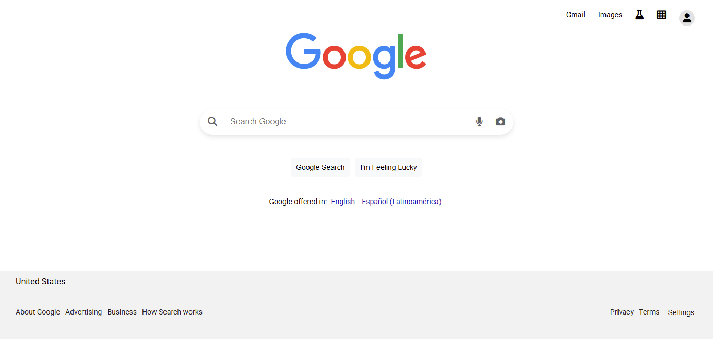
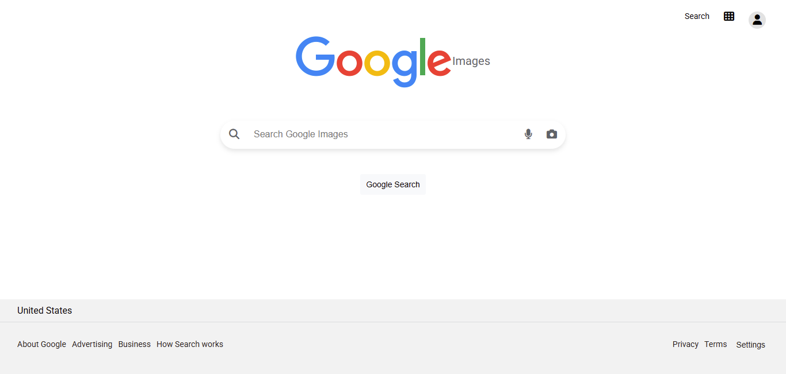
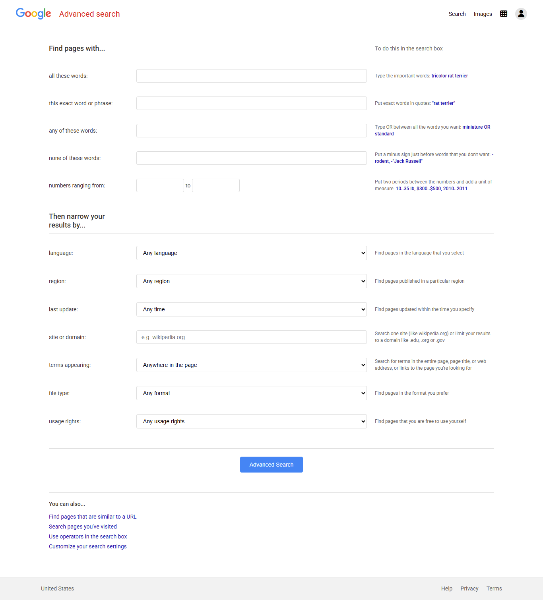

# Search-Web50

## Project Description

🗪 README.md en español: [README_ES.md](README_ES.md)

**Search-Web50** is an implementation of the front-end for Google Search, Google Image Search, and Google Advanced Search. This project corresponds to **Project 0** of Harvard University's course [CS50's Web Programming with Python and JavaScript](https://cs50.harvard.edu/web/projects/0/search/).

## Objective

The goal of this project is to create a web interface that simulates Google's search functionality, allowing users to perform basic searches, image searches, and advanced searches using Google’s GET parameters.

## Implemented Features

### ✅ Main Pages

* **`index.html`** – Google’s main search page
* **`imagenes.html`** – Google’s image search page
* **`advanced-search.html`** – Google’s advanced search page

### ✅ Search Functionalities

* **Basic Search**: Centered search field with rounded corners
* **Image Search**: Image-specific queries using the `tbm=isch` parameter
* **Advanced Search**: Multiple search fields with specific filtering options
* **"I'm Feeling Lucky"**: Button that redirects directly to the first search result

### ✅ Advanced Search Fields

* **"all these words"** – Search for pages containing all these words
* **"this exact word or phrase"** – Search for this exact word or phrase
* **"any of these words"** – Search for any of these words
* **"none of these words"** – Exclude these words from search
* **"numbers ranging from"** – Numeric range
* **"language"** – Filter by language
* **"region"** – Filter by region
* **"last update"** – Filter by last update date
* **"site or domain"** – Search within a specific site
* **"terms appearing"** – Define where terms should appear
* **"file type"** – File type filter
* **"usage rights"** – Usage rights filter

### ✅ Design and UX

* **Responsive Interface**: Layout adapts to different screen sizes
* **Intuitive Navigation**: Navigation links in the upper-right corner
* **Google-like Aesthetics**: CSS mimics the look and feel of Google
* **Dropdown Menu**: Functional configuration dropdown
* **Semantic Tags**: HTML5 structure with proper semantic markup

### ✅ Professional Optimization

* **SEO Optimized**: Complete meta tags for better indexing
* **Custom Favicon**: Google-like icon for visual identity
* **Open Graph Cards**: Engaging previews for social networks (Instagram, Facebook)
* **Twitter Cards**: Optimized sharing for Twitter
* **Complete Meta Tags**: Charset, viewport, description, keywords, author
* **Descriptive Titles**: Specific and informative titles per page

## Project Structure

```
Search-Web50/
├── index.html              # Main search page
├── imagenes.html           # Image search page
├── advanced-search.html    # Advanced search page
├── css/
│   └── style.css          # Project’s CSS styles
├── js/
│   └── script.js          # JavaScript functionality
├── images/
│   ├── search.png         # Screenshot of main search page
│   ├── images.png         # Screenshot of image search page
│   ├── advance.png        # Screenshot of advanced search page
│   └── google_icon.ico    # Project favicon
└── README.md              # This file
```

## Technologies Used

* **HTML5**: Semantic structure using modern tags
* **CSS3**: Responsive styles and modern design
* **JavaScript**: Interactive functionality and form handling
* **Font Awesome**: Interface icons
* **Google Fonts**: Roboto and Source Code Pro typography

## SEO and Social Media Features

### Implemented Meta Tags

* **Charset UTF-8**: Universal character encoding
* **Viewport**: Mobile device optimization
* **Description**: Page-specific meta descriptions
* **Keywords**: SEO-relevant keywords
* **Author**: Project author information
* **Robots**: Indexing and crawling directives

### Open Graph (Instagram/Facebook)

* **og\:type**: Content type (website)
* **og\:title**: Social media optimized titles
* **og\:description**: Appealing sharing descriptions
* **og\:image**: Screenshots used as previews
* **og\:url**: Page-specific URLs
* **og\:site\_name**: Project name

### Twitter Cards

* **twitter\:card**: Summary card with large image
* **twitter\:title**: Twitter-optimized titles
* **twitter\:description**: Twitter-specific descriptions
* **twitter\:image**: Twitter preview images

## Google GET Parameters

The project uses the following GET parameters to interact with Google:

* **`q`**: Main search query
* **`tbm=isch`**: Image search mode
* **`btnI`**: "I'm Feeling Lucky" button
* **`as_q`**: "all these words"
* **`as_epq`**: "this exact word or phrase"
* **`as_oq`**: "any of these words"
* **`as_eq`**: "none of these words"
* **`as_nlo`/`as_nhi`**: Numeric range
* **`lr`**: Language filter
* **`cr`**: Region filter
* **`as_qdr`**: Last update
* **`as_sitesearch`**: Site or domain
* **`as_occt`**: Terms location
* **`as_filetype`**: File type
* **`as_rights`**: Usage rights

## Screenshots

### Main Search Page


*Primary search interface with centered input field*

### Image Search Page


*Dedicated Google image search interface*

### Advanced Search Page


*Full advanced search interface with multiple filtering options*

## How to Use

1. **Clone or download** the project
2. **Open `index.html`** in your web browser
3. **Run searches** using any of the three available pages
4. **Navigate between pages** using the upper-right corner links

## CS50 Project Specifications

This project meets all the requirements defined by [CS50 Web Programming](https://cs50.harvard.edu/web/projects/0/search/):

* ✅ Minimum of three pages (index.html, imagenes.html, advanced-search.html)
* ✅ Navigation links in the top-right corner
* ✅ Centered search field with rounded corners
* ✅ "Google Search" button centered below the search field
* ✅ Functional image search feature
* ✅ Four main advanced search input fields
* ✅ Advanced search fields left-aligned and vertically stacked
* ✅ "Advanced Search" button styled in blue with white text
* ✅ Functional "I'm Feeling Lucky" button
* ✅ CSS mimicking Google’s visual style

## Professional Enhancements

### SEO and Optimization

* ✅ Full meta tags for improved indexing
* ✅ Custom favicon for branding
* ✅ Descriptive and specific page titles
* ✅ Optimized descriptions for search engines

### Social Media

* ✅ Open Graph cards for Instagram and Facebook
* ✅ Twitter Cards for Twitter sharing
* ✅ Appealing preview images
* ✅ Page-specific URLs

### Accessibility and UX

* ✅ Viewport optimized for mobile devices
* ✅ UTF-8 encoding for special characters
* ✅ Robots control for indexing
* ✅ Clear authorship information

## Credits

* **Course**: [CS50's Web Programming with Python and JavaScript](https://cs50.harvard.edu/web/)
* **University**: Harvard University
* **Instructors**: Brian Yu and David J. Malan
* **Original Project**: [CS50 Search Project](https://cs50.harvard.edu/web/projects/0/search/)

## License

This project is part of the CS50 Web Programming course and is intended for educational purposes only.

---

*Developed as part of Project 0 for CS50 Web Programming with Python and JavaScript*
